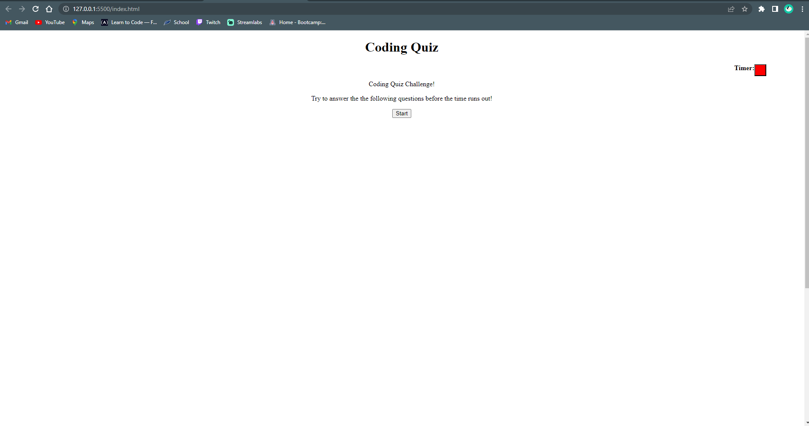

# challenge4codingquiz
Challenge 4 Coding Quiz

## Description
At the start of the website you see the title Coding Quiz and a start button. When you press the start button the quiz and timer start. You can check if your answers are right or wrong. If an answer is wrong it will subtract time from the timer. Once the timer runs out or all of the questions have been answered then you can submit your initials for a high score using local storage.

## Installation
N/A

## Usage
This website uses HTML, CSS, JavaScript and DOM manipulation to create a quiz. Local storage is used to save high scores.

## License
MIT

## Screenshots

## Deployment
https://mugenrider1994.github.io/challenge4codingquiz/